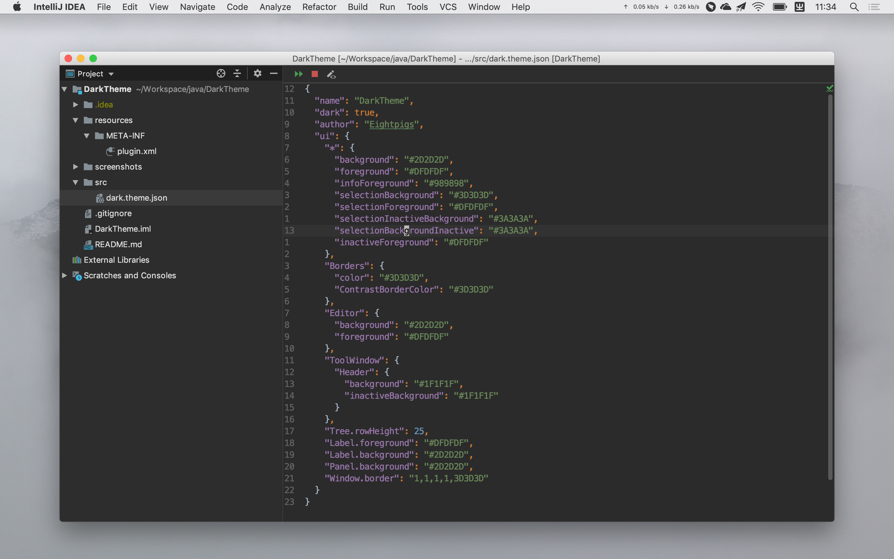
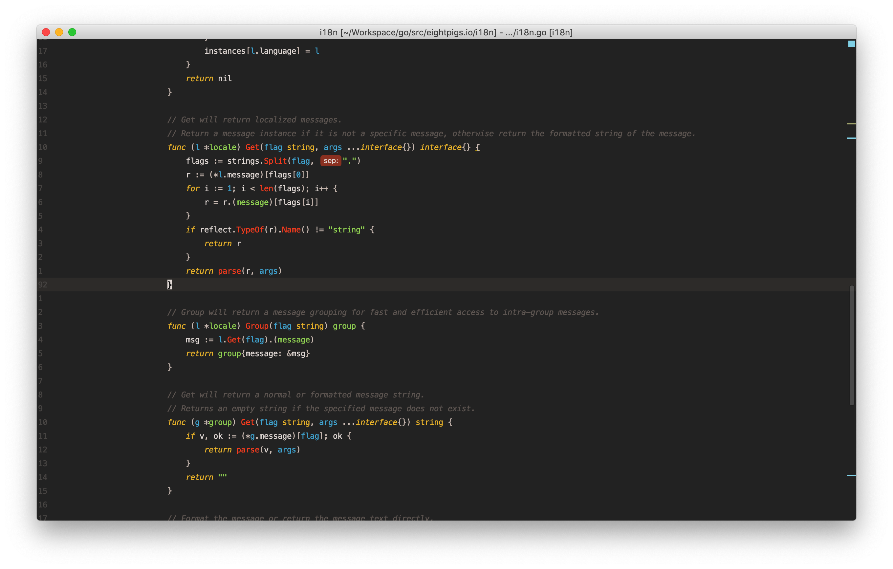

# DarkTheme

A dark theme for JetBrains IDEs.

## Screenshots

## Usage

1. Download [DarkTheme.jar](https://github.com/eightpigs/DarkTheme/releases/download/v0.1/DarkTheme.jar)
2. Install Plugin From Disk